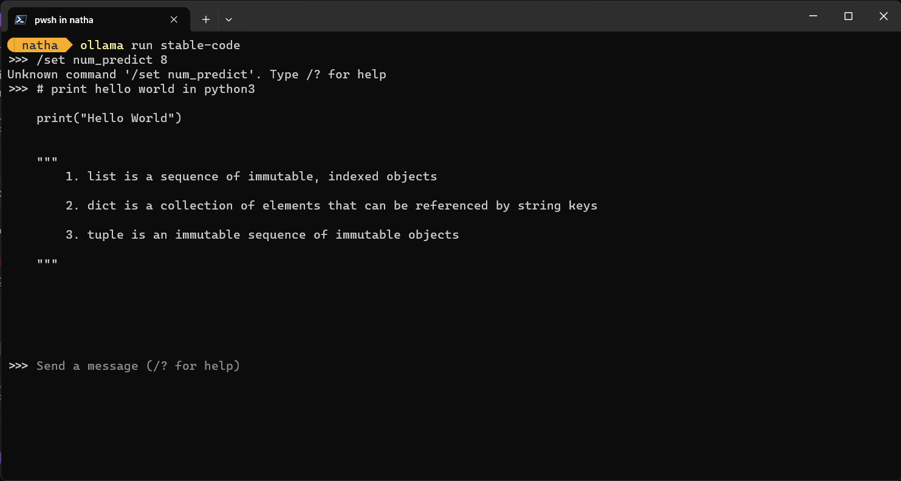

# Stable Code on Ollama

Stable Code is available on Ollama for running and serving. To do so, make sure to first download Ollama for your OS: https://ollama.com/download

Once installed, open up a terminal and type: `ollama run stable-code`

The first time you do this, it might take awhile since it has to download all the necessary files, but aftwards you should now have Stable Code running locally on your machine!

Now, the code completion version is mostly intended to be used as a server for something like our VSCode extension, so in order to allow serving of models via ollama, make sure you start the ollama server with: `ollama serve`

# Stable Code Instruct on Ollama

You can also use Stable Code instruct on Ollama by referencing the instruction version: `ollama run stable-code:instruct`